<div align="center">

<!-- Banner animado -->


<!-- Badges de visitantes e redes -->
<p>
  
  <a href="https://linkedin.com/in/seu-usuario">
    
  </a>
  <a href="mailto:andregustavocrtb@gmail.com">
    
  </a>
  <a href="https://seu-portfolio.com">
    
  </a>
</p>

</div>

---

## 🧑‍💻 Sobre mim

```python
class DevInfo():
  nome=        "André Silveira",
  localizacao= "Brasil 🇧🇷",
  funcao=      "Developer PL/SR",
  trabalhando= "em projetos incríveis 🚀",
  aprendendo=  ["Python", "Go", "Docker", "IA"],
  hobbies=     ["café ☕", "Puzzles", "boa música 🎸"],
```

# - 🔭 Atualmente trabalhando em **[Nome do Projeto]**
- 🌱 Estudando **AGI e Arquitetura**
- 💬 Me pergunte sobre **Python, Go, Clean Architecture**
- 📫 Me encontre em **[andregustavocrtb@gmail.com]**
- ⚡ Curiosidade: **[Adoro Pets]**

---

## 🛠️ Stack & Ferramentas

**Front-end**


**Back-end**


**DevOps & Ferramentas**


---

## 📊 Estatísticas GitHub




<div align="center">
  
</div>

<!-- --- -->
<!-- 
## 🚀 Projetos em Destaque

<div align="center">

[](https://github.com/seu-usuario/nome-do-repo-1)
[](https://github.com/seu-usuario/nome-do-repo-2) -->

<!-- </div>

--- -->
<!-- 
## 🏆 Troféus GitHub

<div align="center">
  
</div>
-->
---

## 📈 Gráfico de Atividade

<div align="center">
  
</div>

---

<div align="center">

### 💡 Frase que me inspira

> *"Qualquer tolo pode escrever código que um computador entende. Bons programadores escrevem código que humanos entendem."*
> — Martin Fowler


</div>